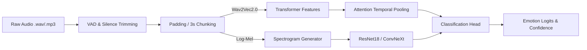

# Multimodal Speech Emotion Recognition (SER) System 🎙️🧠

[](https://www.python.org/downloads/)
[](https://pytorch.org/)
[](https://fastapi.tiangolo.com/)
[](https://opensource.org/licenses/MIT)

An end-to-end, production-grade multimodal pipeline for detecting emotional states from speech. This system leverages state-of-the-art self-supervised audio encoders (Wav2Vec2) and 2D Spectrogram baselines (ResNet18) to classify speech into four primary emotional states: **Calm, Happy, Angry, and Stressed**.

## 🚀 Features
- **Dual Architecture Backbones**: Choose between a HuggingFace `facebook/wav2vec2-base` transformer with Attention Pooling or a `ResNet18` baseline running on Log-Mel Spectrograms.
- **Robust Audio Augmentations**: Dynamic Gaussian noise, pitch shifting, time-stretching, and room impulse response (RIR) simulations using `audiomentations`.
- **Advanced Training Loop**: Features Mixed Precision (AMP), Cosine Annealing, Label Smoothing/Focal Loss, and tracking via Weights & Biases (WandB).
- **Production API Serving**: Containerized FastAPI application that dynamically trims silence and chunks audio streams in memory before inference.
- **Config-Driven**: Fully decoupled hyperparameter and pipeline management via `Hydra`.

---

## 🏗️ Architecture



## 🗂️ Dataset: RAVDESS
The pipeline uses the **Ryerson Audio-Visual Database of Emotional Speech and Song (RAVDESS)**. It automatically remaps the original 8 emotions into 4 robust target classes to mitigate boundary ambiguity:
- `0: Calm` (Neutral, Calm)
- `1: Happy` (Happy, Surprised)
- `2: Angry` (Angry, Disgust)
- `3: Stressed` (Sad, Fearful)

To download and process the dataset automatically:
```bash
python -m src.data.downloader
```

---

## 💻 Installation

### Option 1: Docker (Recommended for Serving)
Ensure you have Docker and Docker Compose installed.
```bash
# Build and start the FastAPI service
docker-compose up --build -d

# Check the health status
curl http://localhost:8000/health
```

### Option 2: Local Development
```bash
# Clone the repository
git clone https://github.com/Amogh0786/multimodal-speech-emotion-recognition.git
cd multimodal-speech-emotion-recognition

# Install dependencies (uv or pip)
pip install -r requirements.txt
```

---

## 🏃‍♂️ Usage & Training

### 1. Training the Model
You can start training directly using the base configuration. The pipeline uses `Hydra`, allowing you to override any parameter from the command line:

```bash
# Train Wav2Vec2 baseline (Default)
python -m src.pipeline.train

# Train ResNet18 on Spectrograms with Focal Loss
python -m src.pipeline.train model.type=resnet18 training.loss=focal

# Tune learning rate
python -m src.pipeline.train training.learning_rate_backbone=1e-4
```

### 2. Hyperparameter Sweeps (WandB)
To run Bayesian hyperparameter optimization:
```bash
wandb sweep configs/sweep_config.yaml
wandb agent <SWEEP_ID>
```

---

## 🌐 API Serving & Inference

The system includes a robust `FastAPI` application for real-time inference.

**Start the Server locally:**
```bash
uvicorn api.app:app --host 0.0.0.0 --port 8000 --reload
```

**Make a Prediction:**
You can send a `multipart/form-data` request with a `.wav`, `.mp3`, or `.flac` file.
```bash
curl -X POST "http://localhost:8000/predict" \
     -H "accept: application/json" \
     -H "Content-Type: multipart/form-data" \
     -F "file=@path/to/your/audio.wav"
```

**Expected JSON Response:**
```json
{
  "emotion": "angry",
  "confidence": 0.8921,
  "distribution": {
    "calm": 0.021,
    "happy": 0.054,
    "angry": 0.892,
    "stressed": 0.033
  },
  "processing_latency_ms": 42.1
}
```

---

## 📂 Project Structure

```text
speech-emotion-recognition/
├── api/                   # FastAPI application & schemas
├── configs/               # Hydra YAML configurations (base & sweep)
├── data/                  # Data directory (gitignored)
├── notebooks/             # EDA and experimental Jupyter notebooks
├── src/
│   ├── data/              # Downloader, Dataset logic, Augmentations
│   ├── models/            # Feature Extractors, Pooling, Classifiers
│   ├── pipeline/          # Training, Evaluation, and Inference loops
│   └── utils/             # Metrics, Logger, and Audio utils
├── tests/                 # Pytest unit tests for pipelines and API
├── Dockerfile             # Multi-stage Docker build
├── docker-compose.yml     # Docker compose for API serving
└── requirements.txt       # Project dependencies
```

## 👤 Author
**GANTA BALA AMOGH RAJ** - [@Amogh0786](https://github.com/Amogh0786)
